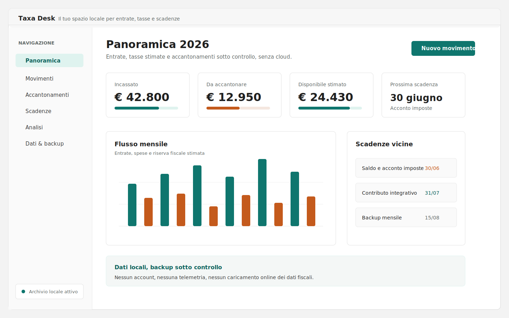

# Taxa Desk

Il tuo spazio locale per entrate, tasse e scadenze.




Taxa Desk è un’app desktop locale per Windows pensata per liberi professionisti e piccoli studi che vogliono tenere sotto controllo incassi, spese, accantonamenti fiscali/previdenziali, scadenze e obiettivi di risparmio senza spostare i propri dati su un cloud applicativo.

> Stato progetto: beta gratuita. Le stime fiscali sono orientative e non sostituiscono commercialista, Agenzia Entrate o cassa previdenziale.

## Per chi è

Taxa Desk è pensato per chi lavora con flussi semplici, vuole capire quanto tenere da parte durante l’anno e desidera arrivare preparato ai momenti fiscali o al confronto con il commercialista.

Non è un gestionale contabile completo, non invia dichiarazioni fiscali, non gestisce fatturazione elettronica e non fornisce consulenza fiscale.

## Perché locale

- Nessun account utente.
- Nessun backend applicativo.
- Nessuna sincronizzazione cloud.
- Nessuna telemetria.
- Database SQLite nella cartella dell’app.
- Backup JSON esportabile e leggibile dall’utente.
- Aggiornamenti online assistiti, sempre avviati dall’utente.

## Funzioni principali

- Profilo fiscale configurabile con coefficienti, aliquote e minimi contributivi.
- Registrazione di entrate e spese con stato reale o previsionale.
- Panoramica annuale di disponibile, previsionale, incassato, pagato e quota da accantonare.
- Stima di imposta sostitutiva, contributo soggettivo e contributo integrativo.
- Obiettivi con target, importo già accantonato, scadenza e rata mensile stimata.
- Scadenze operative e promemoria locali.
- Backup/import JSON e aggiornamenti assistiti da GitHub Releases.

## Avvertenza fiscale

Taxa Desk non è un gestionale contabile completo e non fornisce consulenza fiscale. Le cifre sono stime basate sui dati inseriti e sul profilo configurato. Scadenze, aliquote, minimi, proroghe e requisiti possono cambiare: prima di prendere decisioni o fare versamenti verifica sempre con fonti ufficiali e con il tuo consulente.

## Download

La release pubblica più recente è disponibile nella pagina:

[GitHub Releases](https://github.com/Heylucasabatino/taxa-desk/releases/latest)

Attualmente Taxa Desk è gratuito in beta e disponibile per Windows 10/11 x64. macOS e Linux non sono pianificati per la beta.

Download consigliato per la beta:

- `Taxa.Desk_<versione>_windows_x64_portable.zip`: cartella autonoma con `Taxa Desk.exe`, updater portable e cartelle dati locali.
- Installer `.exe`: canale alternativo per test del bundle Windows.

Prima di usare una nuova versione con dati reali, crea o verifica un backup JSON dalla sezione `Dati & backup`.

## Beta libera

Taxa Desk è scaricabile e utilizzabile gratuitamente durante la beta:

- Uso permesso a privati, liberi professionisti, partite IVA e piccoli studi per la gestione della propria attività.
- Nessun limite artificiale su movimenti, obiettivi, backup o aggiornamenti.
- Nessuna telemetria, nessun account, nessun tracciamento online.

La beta resta gratuita fino alla versione 1.0. Il modello commerciale per le versioni successive non è ancora deciso. La gratuità delle release già scaricate sotto questa licenza non viene comunque revocata: vedi clausola "Future licensing" della [LICENSE](LICENSE).

Il codice resta source-available/proprietario: puoi consultare il repository, segnalare problemi e proporre miglioramenti, ma non puoi redistribuire, vendere o pubblicare versioni modificate senza autorizzazione scritta.

## Feedback beta

Chi prova Taxa Desk può inviare feedback dalla sezione `Dati & backup` dell’app, tramite il pulsante `Invia feedback`.

Il pulsante apre il form pubblico configurato dal maintainer (variabile di build `VITE_FEEDBACK_URL`). Se non è configurato alcun form, l’app indirizza alla issue template GitHub come fallback tecnico, e mostra la stessa voce GitHub anche quando un form pubblico è impostato, per chi preferisce la segnalazione tecnica.

In entrambi i casi non inserire dati fiscali reali, backup completi, contenuti del database SQLite o informazioni personali sensibili.

## Dati locali e backup

La build desktop Tauri usa un database SQLite locale accanto all’eseguibile:

```text
Taxa Desk/
  Taxa Desk.exe
  data/fondi-e-tasse.sqlite
  backups/*.json
  logs/app.log
```

Il backup esporta un file JSON con movimenti, obiettivi, impostazioni fiscali e metadati di versione. L’importazione di un backup sostituisce movimenti e obiettivi locali dopo conferma; le impostazioni fiscali vengono aggiornate dal file importato.

La build web di sviluppo resta compatibile con IndexedDB tramite Dexie nel database locale `funds-and-taxes`.

## Aggiornamenti

Taxa Desk supporta due canali:

- portable updater: scarica un pacchetto update da GitHub Releases, crea un backup JSON locale, chiude l’app, sostituisce solo i file applicativi e riapre Taxa Desk;
- Tauri updater ufficiale: resta disponibile per il canale installer.

Il controllo aggiornamenti scarica solo informazioni sulla versione. I dati dell’archivio restano sul dispositivo. Prima dell’installazione di un aggiornamento, l’app crea un backup JSON locale. Se il backup fallisce, l’installazione viene bloccata.

Dettagli tecnici: [docs/updates.md](docs/updates.md)

## Documentazione

- [Installazione](docs/installation.md)
- [Aggiornamenti e release](docs/updates.md)
- [Checklist release](docs/release-checklist.md)
- [Roadmap portable](docs/portable-roadmap.md)
- [Privacy](PRIVACY.md)
- [Security policy](SECURITY.md)
- [Licenza](LICENSE)

## Sviluppo

Installa le dipendenze:

```bash
npm install
```

Avvia l’app web in sviluppo:

```bash
npm run dev
```

Avvia la shell desktop Tauri in sviluppo:

```bash
npm run tauri:dev
```

Controlli principali:

```bash
npm run build
npm run lint
npm test
npm run tauri:build
```

La build Tauri richiede la toolchain Rust e, su Windows, Microsoft Edge WebView2.

## Licenza

Copyright (c) 2026 Luca Sabatino. Tutti i diritti riservati.

Taxa Desk è gratuito in beta per uso personale e valutazione. Il codice e gli asset restano protetti: non possono essere modificati, redistribuiti o usati commercialmente senza autorizzazione scritta. Vedi [LICENSE](LICENSE).
